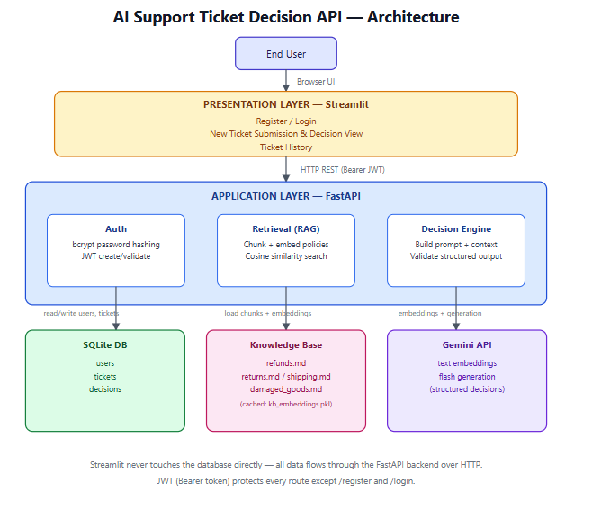
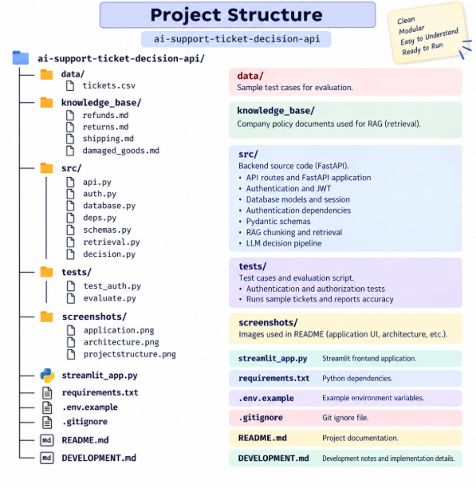

AI Support Ticket Decision API

An AI-powered support-ticket decision assistant. A user registers, logs in, submits a support ticket, and gets back an evidence-backed recommendation grounded in company policy documents (RAG + Gemini LLM). Everything is persisted in SQLite.

What it does
1. User registers / logs in → gets a JWT
2. User submits a ticket (e.g. "My order arrived damaged, it cost 3000 rupees")
3. Backend retrieves the most relevant policy chunks (RAG)
4. Gemini LLM makes a structured decision using only that context
5. Ticket + decision are saved to the database and shown in the UI

# Architecture

 The application uses Streamlit for the frontend, FastAPI for the backend,
RAG for policy retrieval, Gemini for AI decisions, and SQLite for persistence.

# Request Flow

1. User types their issue in Streamlit and clicks **Get Decision**
2. Streamlit sends `POST /tickets` with the JWT and message
3. FastAPI saves the ticket to SQLite
4. FastAPI embeds the message via Gemini
5. FastAPI retrieves the top 3 relevant policy chunks (cosine similarity)
6. FastAPI sends the ticket + chunks to Gemini as context
7. Gemini returns structured JSON, validated against a Pydantic schema
8. FastAPI saves the decision to SQLite
9. Response returned to Streamlit
10. Streamlit displays the result to the user

# Tech stack
Backend: FastAPI, SQLAlchemy, Pydantic
Database: SQLite
Auth: JWT (python-jose) + bcrypt
LLM / Embeddings: Google Gemini (gemini-3.6-flash for decisions, gemini-embedding-001 for embeddings)
Frontend: Streamlit
Testing: pytest
  

#  Project structure

  #  Setup
1. Create a virtual environment
powershell
python -m venv .venv
.venv\Scripts\activate
2. Install dependencies
powershell
pip install -r requirements.txt
3. Configure environment variables

Copy .env.example to .env and fill in your own values:

powershell
copy .env.example .env
GEMINI_API_KEY=your-real-gemini-api-key
JWT_SECRET=some-random-secret-string
JWT_ALGORITHM=HS256
JWT_EXPIRE_MINUTES=60
DATABASE_URL=sqlite:///./app.db

Get a free Gemini API key at: https://aistudio.google.com/u/0/api-keys

4. Run the backend
powershell
uvicorn src.api:app --reload --reload-dir src

API: http://127.0.0.1:8000 — interactive docs: http://127.0.0.1:8000/docs

The SQLite database (app.db) is created automatically on first run.

5. Run the frontend

In a separate terminal (keep the backend running):

powershell
.venv\Scripts\activate
streamlit run streamlit_app.py

Opens at http://localhost:8501

Using the app
Register on the login page
Log in
Go to New Decision, describe your issue, click Get Decision — see the recommended action, confidence, reasoning, and cited sources
Go to History to view past tickets and their decisions

All protected routes require Authorization: Bearer <JWT>.

# RAG pipeline

## API Endpoints

## API Endpoints

| Method | Endpoint | Purpose | Auth Required |
|:------:|----------|---------|:-------------:|
| `POST` | `/register` | Create a new user account | ❌ No |
| `POST` | `/login` | Verify credentials and return a JWT | ❌ No |
| `GET` | `/me` | Get the authenticated user's details | ✅ Yes |
| `POST` | `/tickets` | Submit a ticket and generate an AI decision | ✅ Yes |
| `GET` | `/tickets` | Get all tickets for the current user | ✅ Yes |
| `GET` | `/tickets/{id}` | Get a specific ticket and its decision | ✅ Yes |

All protected routes require `Authorization: Bearer <JWT>`.
Policy .md files in knowledge_base/ are loaded and split into ~500-character overlapping chunks
Each chunk is embedded with Gemini and cached locally to kb_embeddings.pkl (numpy array, no vector DB)
An incoming ticket is embedded and compared against cached chunks with cosine similarity
The top-3 matching chunks are passed to the LLM as context
AI decision pipeline

Gemini is prompted with the ticket + retrieved policy context and must return JSON like:

json
{
  "action": "REQUEST_PHOTOS",
  "confidence": 0.95,
  "reason": "Orders above ₹2,000 require photographic evidence of damage before a refund or replacement.",
  "sources": ["damaged_goods.md"]
}

Valid actions: APPROVE_REFUND, APPROVE_REPLACEMENT, REQUEST_PHOTOS, DENY, ESCALATE, NEEDS_MORE_INFORMATION.

The response is validated against a Pydantic schema. If it's malformed or invalid, the system falls back to NEEDS_MORE_INFORMATION rather than persisting a guessed decision.

# Testing
powershell
pytest tests/test_auth.py -v

Covers registration, login, /me auth enforcement, and the required authorization test — proving one user's JWT cannot retrieve another user's ticket. The AI call is mocked here so tests are fast and don't depend on Gemini's live API.

# Evaluation
powershell
python -u tests/evaluate.py

Runs the sample tickets in data/tickets.csv through the real pipeline and reports accuracy:

20 test cases
Correct: 17
Incorrect: 3
Accuracy: 85.0%

Note: Gemini's free tier is limited to 5 requests/minute, so this script includes delays between cases and can take several minutes. Avoid running other Gemini calls (Streamlit, pytest) at the same time.

#  Known limitations
Free-tier Gemini rate limits (5 req/min) can affect heavy testing
Delete kb_embeddings.pkl to force re-embedding if the knowledge base changes
SQLite is used for simplicity, per assignment scope — not for concurrent production use

